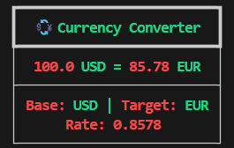

# 💱 Currency Converter CLI

A simple yet stylish **Currency Converter** built with Python.  
It fetches **real-time exchange rates** from the [Frankfurter API](https://www.frankfurter.app/) and displays results in a **beautiful table** using [Rich](https://github.com/Textualize/rich).  

---

## ✨ Features
- Convert any amount between supported currencies.
- Validation for unsupported or invalid inputs.
- Clean, colorful CLI output using `rich`.
- Supported currencies are stored in a JSON file for easy reference.
- Custom error handling for a smooth user experience.

---

## 📦 Requirements
- Python 3.8+
- [requests](https://pypi.org/project/requests/)
- [rich](https://pypi.org/project/rich/)

Install dependencies:


```bash
pip install -r requirements.txt

```

## 👤 Usage

Run the program with:
```bash
python main.py <Amount> <Base> <Target>
```
Example:
```bash
python main.py **100** USD EUR
```

